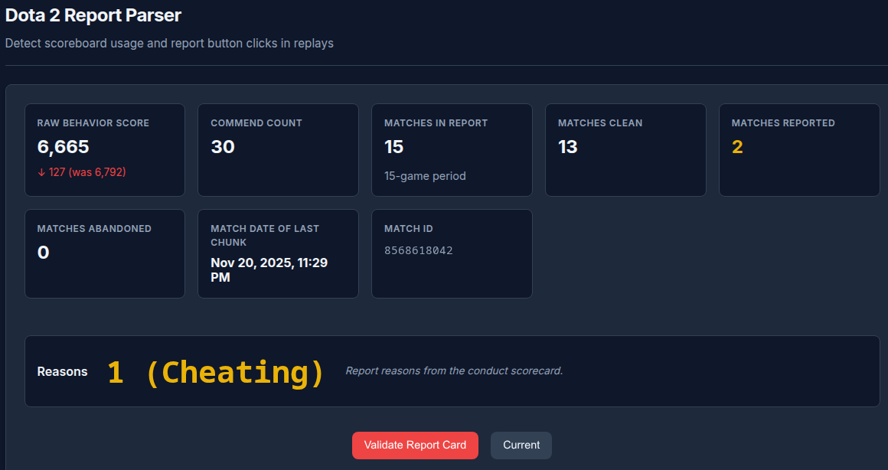
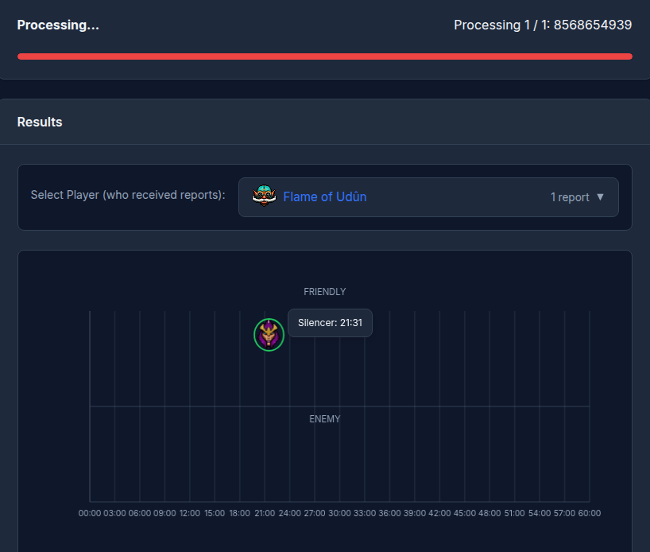
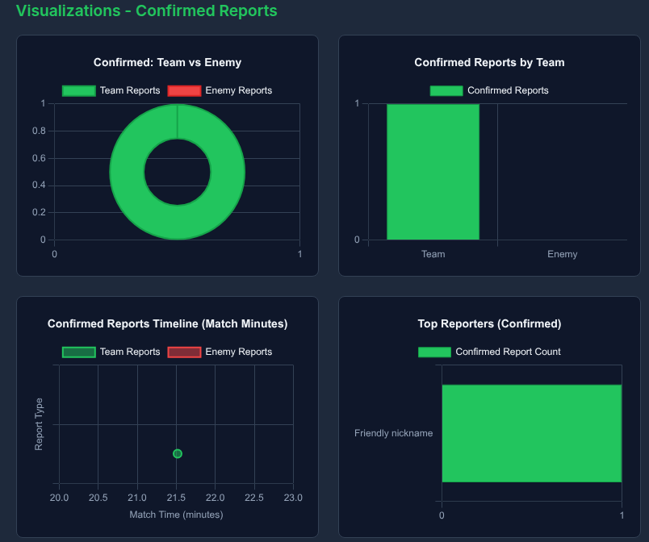

# 🕵️ Dota 2 Report Timestamp Tool

**Unlock the psychology behind player reports.** 🧠



## ⚠️ The Problem
The report system in Dota 2 is **deeply flawed**. It's often used as a rage button rather than a tool for justice. 😡

This project was created in an effort to **better understand the psychology behind player's reports**. We want to know *exactly* what triggers a report in the heat of the moment.

I am very interested to see what other people learn! 🧐 This tool helps you efficiently acquire **hard-evidence** for why the system doesn't really work as intended.

## ✨ Features

*   **See "Invisible" Reports** 👀: We detect exactly when a player opens the scoreboard and clicks the report button.
*   **Beautiful GUI** 🖥️: No complex commands, just a nice web interface.
*   **Auto-Download** 📥: Automatically fetch your recent matches to analyze.
*   **Deep Insights** 📊: See who reported whom, when, and confirmed vs. unconfirmed reports.




## 🚀 How to Install & Use

It is super simple to get started!

1.  **Install Go** (make sure you have it installed).
2.  **Clone this repo**:
    ```bash
    git clone https://github.com/d3nd3/dota-report-timestamps
    cd dota-report-timestamps
    ```
3.  **Run the easy script**:
    ```bash
    ./run.sh
    ```
4.  **Open your browser**: Go to `http://localhost:8081` 🌐

That's it! You are ready to analyze. Happy hunting! 🏹

