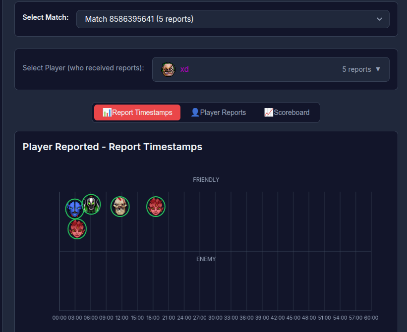
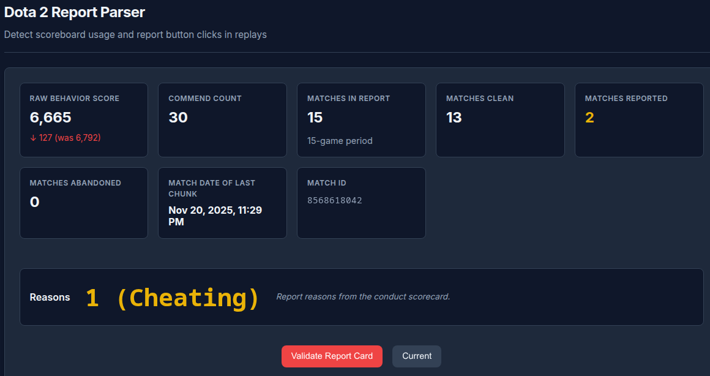

# 🕵️ Dota 2 Report Timestamp Tool

**Unlock the psychology behind player reports.** 🧠

## ⚠️ The Problem
The report system in Dota 2 is **deeply flawed**. It's often used as a rage button rather than a tool for justice. 😡

This project was created in an effort to **better understand the psychology behind player's reports**. We want to know *exactly* what triggers a report in the heat of the moment.

I am very interested to see what other people learn! 🧐 This tool helps you efficiently acquire **hard-evidence** for why the system doesn't really work as intended.

## ✨ Features

*   **See "Invisible" Reports** 👀: We detect exactly when a player opens the scoreboard and clicks the report button.
*   **Easy-to-Use Web Interface** 🖥️: No complex commands needed - just open your web browser and use the tool like any website. (GUI stands for "Graphical User Interface" - it just means you click buttons instead of typing commands.)
*   **Auto-Download** 📥: Automatically download your recent matches to analyze.
*   **Deep Insights** 📊: See who reported whom, when, and confirmed vs. unconfirmed reports.



## 🚀 Quick Start (Easiest Way - No Installation Required!)

**Just want to use the tool?** Download a pre-built version - no Go, Git, or command line needed!

1. **Download**: Go to the [Releases page](https://github.com/d3nd3/dota-report-timestamps/releases) and download the zip file for your operating system (Windows, Mac, or Linux)

2. **Extract**: Extract the zip file to any folder on your computer

3. **Run**: 
   - **Windows**: Double-click `launch-windows.bat`
   - **Mac**: Double-click `launch-mac.sh` (or open Terminal, go to the folder, and type `./launch-mac.sh`)
   - **Linux**: Open Terminal, go to the folder, and type `./launch-linux.sh`

4. **Use**: Your browser will open automatically to http://localhost:8081 - log in with your Steam account and start analyzing!

**That's it!** No need to install Go, Git, or anything else. The tool is ready to use.

> **Note**: Keep the launcher window open while using the tool. To stop it, press Ctrl+C in that window.

### 📁 Understanding the Replay Directory Structure

When you first open the tool, you'll need to configure the **Replay Directory**. Here's how it works:

1. **Base Replay Directory**: Set this to your Dota 2 replays folder. The default location is usually:
   - **Windows**: `C:\Program Files (x86)\Steam\steamapps\common\dota 2 beta\game\dota\replays\`
   - **Linux**: `~/.steam/debian-installation/steamapps/common/dota 2 beta/game/dota/replays/`
   - **Mac**: `~/Library/Application Support/Steam/steamapps/common/dota 2 beta/game/dota/replays/`

2. **Profile-Based Organization**: 
   - If you **don't select a profile**, replays are looked for directly in the base directory
   - If you **select a profile** (e.g., "Main"), replays are looked for in: `{base directory}/{ProfileName}/`
   - For example: `/path/to/replays/Main/` or `/path/to/replays/Main/fatal/` for fatal games

3. **Current Path Display**: The file browser on the right shows the full path it's currently browsing, including the base directory and any selected profile subdirectory.

**Tip**: You can organize replays by profile by creating subdirectories in your replays folder. The tool will automatically detect and browse them when you select the corresponding profile.

---

## 🔧 Building from Source (For Developers)

Want to build from source or contribute? Follow the instructions below.

### What You Need (Before You Start)

Before installing, you'll need a few things. Don't worry - we'll explain what each one is and how to get it:

*   **Go** - This is a programming language that the tool needs to run. Think of it like a special tool that lets the program work. You'll download it once and install it like any other program.
*   **Git** - This is a program that helps you download the project files from the internet. Most computers don't have this installed by default, but it's free and easy to install.
*   **Terminal/Command Prompt** - This is a special window where you type commands (instructions) to your computer. On Windows it's called "Command Prompt" or "PowerShell", on Mac and Linux it's called "Terminal". Don't worry - we'll show you exactly how to open it.
*   **Steam Account** - You'll need your Steam username and password to log in through the tool's web interface. The tool uses Steam's "GC API" (Game Coordinator API) to download replays - this is just Steam's system for getting match data. You don't need to do anything special with it; the tool handles it automatically when you log in through the web interface.

**What is "cloning a repo"?** - This just means downloading the project files from the internet. We'll show you exactly how to do this.

**What is "running a script"?** - A script is just a file with instructions for your computer. Running it means telling your computer to follow those instructions. We'll show you exactly how to do this too.

---

### Installation Instructions for Building from Source

Choose your operating system below and follow the step-by-step instructions:

#### Windows

1.  **Install Go**:
    *   Go to https://go.dev/dl/ in your web browser
    *   Find the section that says "Microsoft Windows"
    *   Click the big blue button that says something like "go1.24.0.windows-amd64.msi" (the version number might be different, but it should be the largest file)
    *   The file will download. When it's done, double-click the downloaded file (it will be in your Downloads folder)
    *   A window will pop up asking you to install Go. Click "Next" through all the steps, using the default options
    *   When it says "Installation Complete", click "Finish"
    *   **Important**: Close any Command Prompt or PowerShell windows you have open, then open a new one (we'll show you how in step 2)

2.  **Install Git**:
    *   Go to https://git-scm.com/download/win in your web browser
    *   The website should automatically detect you're on Windows and show a download button
    *   Click the download button and wait for the file to download
    *   Double-click the downloaded file and follow the installation wizard (just click "Next" through all steps using the default options)
    *   When it's done, close any Command Prompt windows you have open

3.  **Open Command Prompt**:
    *   Press the Windows key on your keyboard (the key with the Windows logo)
    *   Type "cmd" (without quotes)
    *   You'll see "Command Prompt" appear in the search results
    *   Click on it or press Enter
    *   A black window will open - this is where you'll type commands

4.  **Download the project files**:
    *   In the Command Prompt window, type this exactly (you can copy and paste it):
        ```
        git clone https://github.com/d3nd3/dota-report-timestamps
        ```
    *   Press Enter
    *   You'll see text scrolling - this is normal! It's downloading the files
    *   When it stops and shows a prompt again (something like `C:\Users\YourName>`), type:
        ```
        cd dota-report-timestamps
        ```
    *   Press Enter
    *   You should now see `C:\Users\YourName\dota-report-timestamps>` - this means you're in the right folder

5.  **Start the program**:
    *   In the same Command Prompt window, type:
        ```
        bash run.sh
        ```
    *   Press Enter
    *   **Note**: If you get an error saying "bash is not recognized", try this instead:
        ```
        .\run.sh
        ```
    *   You'll see text scrolling as the program builds and starts
    *   Wait until you see a message that says "Starting server on http://localhost:8081"
    *   **Important**: Keep this window open! If you close it, the program will stop

6.  **Open the tool in your browser**:
    *   Open any web browser (Chrome, Firefox, Edge, etc.)
    *   In the address bar at the top, type exactly:
        ```
        http://localhost:8081
        ```
    *   Press Enter
    *   The tool's web interface should open! You can now log in with your Steam account through the web page

That's it! You're ready to analyze your replays. Happy hunting! 🏹

**To stop the program later**: Go back to the Command Prompt window and press `Ctrl+C` (hold Ctrl and press C). This will stop the program.

---

#### Mac

1.  **Install Go**:
    *   Go to https://go.dev/dl/ in your web browser
    *   Find the section that says "Apple macOS"
    *   Click the file that says something like "go1.24.0.darwin-amd64.pkg" (the version number might be different)
    *   The file will download. When it's done, double-click the downloaded file (it will be in your Downloads folder)
    *   A window will pop up asking you to install Go. Click "Continue" through all the steps
    *   You may be asked for your password - enter it when prompted
    *   When it says "The installation was successful", click "Close"
    *   **Important**: Close any Terminal windows you have open, then open a new one (we'll show you how in step 2)

2.  **Install Git** (if you don't have it):
    *   Open Terminal (we'll show you how in step 3)
    *   Type this command:
        ```
        git --version
        ```
    *   Press Enter
    *   If you see a version number (like "git version 2.x.x"), you already have Git! Skip to step 3
    *   If you see an error or it asks you to install something, you need to install Git:
        *   Go to https://git-scm.com/download/mac
        *   Download the installer and follow the instructions
        *   Or, if you have Homebrew installed, you can type: `brew install git`

3.  **Open Terminal**:
    *   Press `Command + Space` (hold the Command key and press Space)
    *   Type "Terminal" (without quotes)
    *   Press Enter
    *   A window will open - this is where you'll type commands

4.  **Download the project files**:
    *   In the Terminal window, type this exactly (you can copy and paste it):
        ```
        git clone https://github.com/d3nd3/dota-report-timestamps
        ```
    *   Press Enter
    *   You'll see text scrolling - this is normal! It's downloading the files
    *   When it stops and shows a prompt again (something like `YourName-MacBook:~ YourName$`), type:
        ```
        cd dota-report-timestamps
        ```
    *   Press Enter
    *   You should now see `YourName-MacBook:dota-report-timestamps YourName$` - this means you're in the right folder

5.  **Start the program**:
    *   In the same Terminal window, type:
        ```
        ./run.sh
        ```
    *   Press Enter
    *   You may see a message asking for permission - if so, type "y" and press Enter
    *   You'll see text scrolling as the program builds and starts
    *   Wait until you see a message that says "Starting server on http://localhost:8081"
    *   **Important**: Keep this window open! If you close it, the program will stop

6.  **Open the tool in your browser**:
    *   Open any web browser (Chrome, Firefox, Safari, etc.)
    *   In the address bar at the top, type exactly:
        ```
        http://localhost:8081
        ```
    *   Press Enter
    *   The tool's web interface should open! You can now log in with your Steam account through the web page

That's it! You're ready to analyze your replays. Happy hunting! 🏹

**To stop the program later**: Go back to the Terminal window and press `Ctrl+C` (hold Ctrl and press C). This will stop the program.

---

#### Linux

1.  **Install Go**:
    *   Open Terminal (press `Ctrl+Alt+T` or search for "Terminal" in your applications menu)
    *   Type this command to download Go (you can copy and paste it):
        ```
        wget https://go.dev/dl/go1.24.0.linux-amd64.tar.gz
        ```
    *   Press Enter and wait for it to download
    *   **Note**: If the version number is different, check https://go.dev/dl/ for the latest version and replace "1.24.0" in the command above
    *   Now remove any old Go installation and install the new one:
        ```
        sudo rm -rf /usr/local/go && sudo tar -C /usr/local -xzf go1.24.0.linux-amd64.tar.gz
        ```
    *   Press Enter (you'll be asked for your password - type it and press Enter)
    *   Add Go to your PATH by typing:
        ```
        echo 'export PATH=$PATH:/usr/local/go/bin' >> ~/.bashrc
        ```
    *   Press Enter
    *   Then reload your settings:
        ```
        source ~/.bashrc
        ```
    *   Press Enter
    *   Close the Terminal window and open a new one (this makes sure the changes take effect)

2.  **Install Git** (if you don't have it):
    *   Open Terminal
    *   Type this command:
        ```
        git --version
        ```
    *   Press Enter
    *   If you see a version number (like "git version 2.x.x"), you already have Git! Skip to step 3
    *   If you see an error, install Git with one of these commands (try the first one that matches your system):
        *   **Ubuntu/Debian**: `sudo apt update && sudo apt install git`
        *   **Fedora**: `sudo dnf install git`
        *   **Arch Linux**: `sudo pacman -S git`
    *   Press Enter and wait for it to install

3.  **Open Terminal** (if not already open):
    *   Press `Ctrl+Alt+T` or search for "Terminal" in your applications menu

4.  **Download the project files**:
    *   In the Terminal window, type this exactly (you can copy and paste it):
        ```
        git clone https://github.com/d3nd3/dota-report-timestamps
        ```
    *   Press Enter
    *   You'll see text scrolling - this is normal! It's downloading the files
    *   When it stops and shows a prompt again (something like `username@computer:~$`), type:
        ```
        cd dota-report-timestamps
        ```
    *   Press Enter
    *   You should now see `username@computer:~/dota-report-timestamps$` - this means you're in the right folder

5.  **Start the program**:
    *   In the same Terminal window, type:
        ```
        ./run.sh
        ```
    *   Press Enter
    *   You may need to make the script executable first. If you get a "permission denied" error, type this first:
        ```
        chmod +x run.sh
        ```
    *   Then try `./run.sh` again
    *   You'll see text scrolling as the program builds and starts
    *   Wait until you see a message that says "Starting server on http://localhost:8081"
    *   **Important**: Keep this window open! If you close it, the program will stop

6.  **Open the tool in your browser**:
    *   Open any web browser (Chrome, Firefox, etc.)
    *   In the address bar at the top, type exactly:
        ```
        http://localhost:8081
        ```
    *   Press Enter
    *   The tool's web interface should open! You can now log in with your Steam account through the web page

That's it! You're ready to analyze your replays. Happy hunting! 🏹

**To stop the program later**: Go back to the Terminal window and press `Ctrl+C` (hold Ctrl and press C). This will stop the program.

---

### Troubleshooting

Having problems? Here are some common issues and how to fix them:

**"go: command not found" or "Go not found"**
*   This means Go isn't installed or your computer can't find it
*   **Windows**: Make sure you installed Go and closed/reopened Command Prompt after installing
*   **Mac**: Make sure you installed Go and closed/reopened Terminal after installing. Try typing `which go` - if nothing appears, Go isn't installed correctly
*   **Linux**: Make sure you followed all the installation steps including the `source ~/.bashrc` command, and that you closed/reopened Terminal

**"git: command not found" or "Git not found"**
*   This means Git isn't installed
*   Follow the Git installation steps for your operating system above

**"Permission denied" when running `./run.sh`**
*   **Mac/Linux**: Type `chmod +x run.sh` and press Enter, then try `./run.sh` again
*   **Windows**: Try using `bash run.sh` instead of `./run.sh`

**"Port 8081 is already in use" or "Address already in use"**
*   This means something else is using port 8081
*   Close any other programs that might be using it, or stop any previous instances of this tool
*   You can also change the port by editing the code, but that's more advanced

**"Cannot connect to http://localhost:8081"**
*   Make sure the program is still running (check the Terminal/Command Prompt window)
*   Make sure you typed `http://localhost:8081` exactly (not `https://` and not `localhost:8080`)
*   Try waiting a few seconds - the program might still be starting up
*   Check if you see any error messages in the Terminal/Command Prompt window

**Steam login not working**
*   Make sure you're entering your Steam username and password correctly
*   If you have Steam Guard enabled (which you should!), you'll need to enter the code from your email or mobile app when prompted
*   The tool uses Steam's official login system - your credentials are only sent to Steam, not stored by this tool

**The program stops working or crashes**
*   Check the Terminal/Command Prompt window for error messages
*   Make sure you have a stable internet connection
*   Try closing the program (Ctrl+C) and starting it again with `./run.sh` (or `bash run.sh` on Windows)

**Still having problems?**
*   Check that you followed all the steps for your operating system
*   Make sure you're in the correct folder (you should see "dota-report-timestamps" in your Terminal/Command Prompt prompt)
*   Try closing everything and starting from step 4 (downloading the project files) again


---
